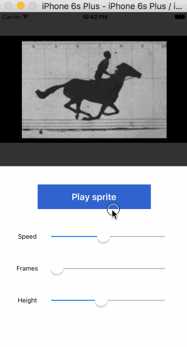
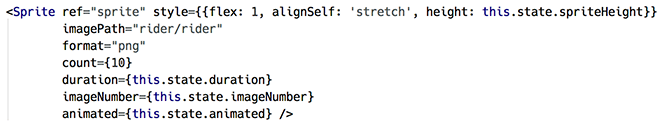
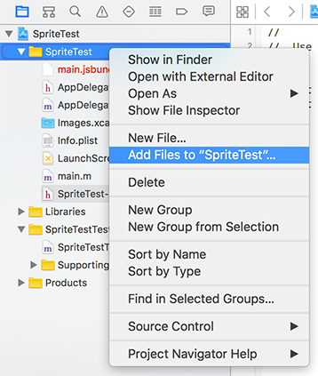
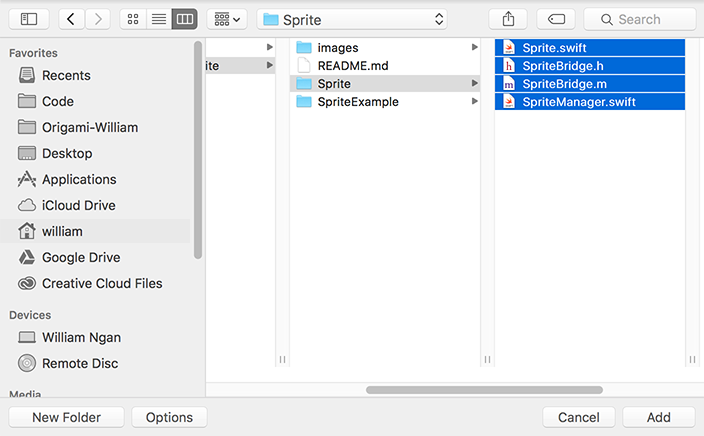
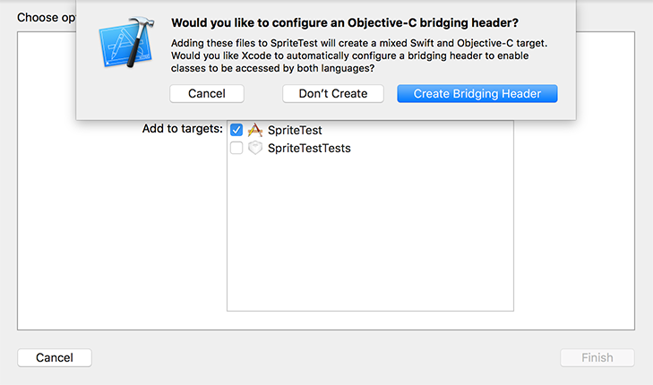
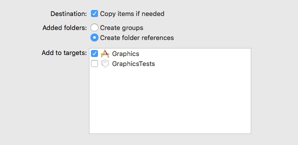

# Animated Image Sequence for React Native (iOS)
`react-native-sprite` is a React Native component for animating a sequence of images. Under the hood, it bridges UIImageView to animate images in native iOS.

This is experimental and currently works in XCode **7.3** with React Native **0.34**. There's also a basic **Swift 3** example in [SpriteExampleSwift3](https://github.com/williamngan/react-native-sprite/tree/master/SpriteExampleSwift3) folder.

The folders are organized like this:

- [**Sprite**](./Sprite) : the iOS bridge stuff
- [**SpriteComponent**](./SpriteComponent) : Component for react-native
- [**SpriteExample**](./SpriteExample) An example react-native project with Sprite component

&nbsp;   
   
## Example
First, download or clone this repo, and then go to Terminal or CMD, and run `npm install` in the `SpriteExample` folder. This will download the `react-native` library. It may take a while.

Then, run `react-native run-ios` in `SpriteExample` folder. You should see this when it finishes building. Woot!




## Known Issues
- Avoid using a long sequence of large images. This may make it crash in older iPhones and/or take a long time to load. Please submit a pull request if you have a fix for [this issue](https://github.com/williamngan/react-native-sprite/issues/4).
- React Native is a bit of a moving target and many things undocumented. Please file [issues](https://github.com/williamngan/react-native-sprite/issues) or ping [@williamngan](https://twitter.com/williamngan) for bugs and suggestions.  
- Experimental, with rough edges :sweat_smile:

&nbsp;  

## Component Properties
The Sprite component has the following props:   
&nbsp;   

| prop | type | description | required |
|------|------|-------------|----------|
| **imagePath** | string | A string to specify "folder/name". Eg, if you added a folder called "hello", with files "world0.png ... world10.png" inside, the `imagePath` would be "hello/world"  | yes |
| **count** | integer | Number of images in your sequence | yes |
| **format** | string | Your image file's extension. Eg, "png" or "jpg". Default is "png" | no |
| **duration** | float | Time in seconds to play a full cycle of your image sequence. Eg, 0.5 = play a full sequence every 500 milliseconds. Default is 0.5. | no |
| **animated** | boolean | A boolean to start or stop the animation. Default is false. | no |
| **imageNumber** | integer | When not animating, you can display a specific image by its number. Eg, 3 will display "img3.png" | no |
| **repeatCount** | integer | Number of loops to play before animation stops. If unspecified, animation will play continuously. | no |
| **contentMode** | string | A string key to specify how to lay out the image in view. Valid keys are: `contain, cover, stretch, top, bottom, left, right, topLeft, topRight, bottomLeft, bottomRight`. Default is "contain". | no |

&nbsp;   

Additionally, Sprite component also provides 2 methods: `createSequence(nameWithPath, count, format, duration)` and `animate( shouldPlay )` if you need them instead of using props above.

Take a look at `index.ios.js` in `SpriteExample` folder for reference.   


    
&nbsp;

## Setting it up in your project

Add this component into your react-native project in these 7 tedious steps! I wish there's an easier way :expressionless:

**1)** Open your iOS project in XCode (eg, in `ProjectFoo/ios/ProjectFoo.xcodeproj`). `ProjectFoo` is your react-native project folder.

**2)** In XCode, right-click on your `ProjectFoo` folder, and select "Add Files to ProjectFoo..."   
   
   

**3)** Navigate to your downloaded `react-native-sprite` folder, click the subfolder `Sprite`, and select all files in there, and click "Add".   
   
   

**4)** At this point, XCode will ask if you want to create a Bridging Header. Yes, create it.   
(In case you miss it, you can manually create a header file named "ProjectFoo-Bridging-Header.h" later.) 
   
   

**5)** Next, add a folder of images that you want to animate. You can find some images in [`react-native-sprite/SpriteExample/ios/rider`](./SpriteExample/ios/rider) for testing. Like step #2, right-click the project folder and select "Add files..."   

Choose **`Copy items if needed`** and **`Create folder reference`** (if you want to refer the images by **`folder/imageName`**) under [Options in the dialog](https://developer.apple.com/library/ios/recipes/xcode_help-structure_navigator/articles/Adding_an_Existing_File_or_Folder.html).



Note that you may need to clean and rebuild XCode project after adding new assets. 

**6)** Click on the generated bridge header file from step 4 (`ProjectFoo-Bridging-Header.h`), and add these two lines into the file.   
   
```objective-c
#import "RCTViewManager.h"
#import "RCTUIManager.h"
```   
   
   
   
**7)** Almost there! Finally, copy the `Sprite.js` file in `SpriteComponent` folder into your ReactNative project. (Not in XCode "ios" project.) Alternatively, get it from [`npm install react-native-sprite`](https://www.npmjs.com/package/react-native-sprite).

Then you can use it as a component like this:   
   
```javascript
const Sprite = require('./Sprite.js');
// import Sprite from 'react-native-sprite'; // Use this if you install from npm

class SpriteExample extends Component {
  
  ...
  
  render() {
    return (<View><Sprite style={...} imagePath="folder/imgName" count={10} animated={true} /></View>)
  }
}
```
 
Take a look at `index.ios.js` in `SpriteExample` folder for reference.   

And that's it. Run `react-native run-ios` in Terminal, or click the Play button in XCode to test it in Simulator.
&nbsp;    


## Have fun!


## License
[Apache Version 2.0](https://github.com/williamngan/react-native-sprite/blob/master/LICENSE)
